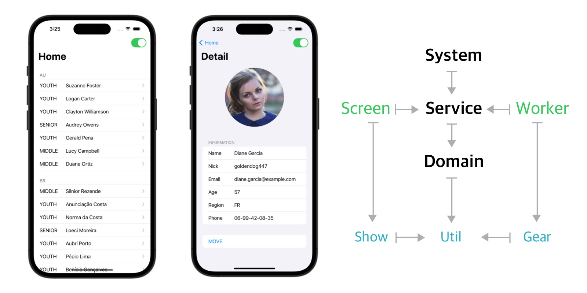

# PureIOS

* [Pure Android Project](https://github.com/kiroshin/PureAOS)
* [Pure Python Project](https://github.com/kiroshin/PurePYQ)

클린 아키텍처의 기본적인 사항과 Redux 의 AppState 를 간략화한, 단순하고 직관적인 아키텍처입니다.

* [아키텍처(MVC를 위한 변명)](https://kiroshin.github.io/2024-07-15-architecture)
* [정말 튼튼한 아키텍처](https://kiroshin.github.io/2024-07-17-pure-simple)
* [미니멀로 구성하기](https://kiroshin.github.io/2024-07-22-hello-pure)
  - 종합 컨테이너 `Vessel`
  - `Usecase` 는 클래스에서 함수로
  - 관찰 가능한 전역 상태 `AppState`
  - 상태변화는 `Action`, 자료읽기는 `Query`
  - 잠깐 거쳐가는 도메인 모델
  - `Gear` 는 `Worker`를 움직이는 힘
  - Statefull `View`, Stateless `Show`
  - 양방향도 괜찮아!

